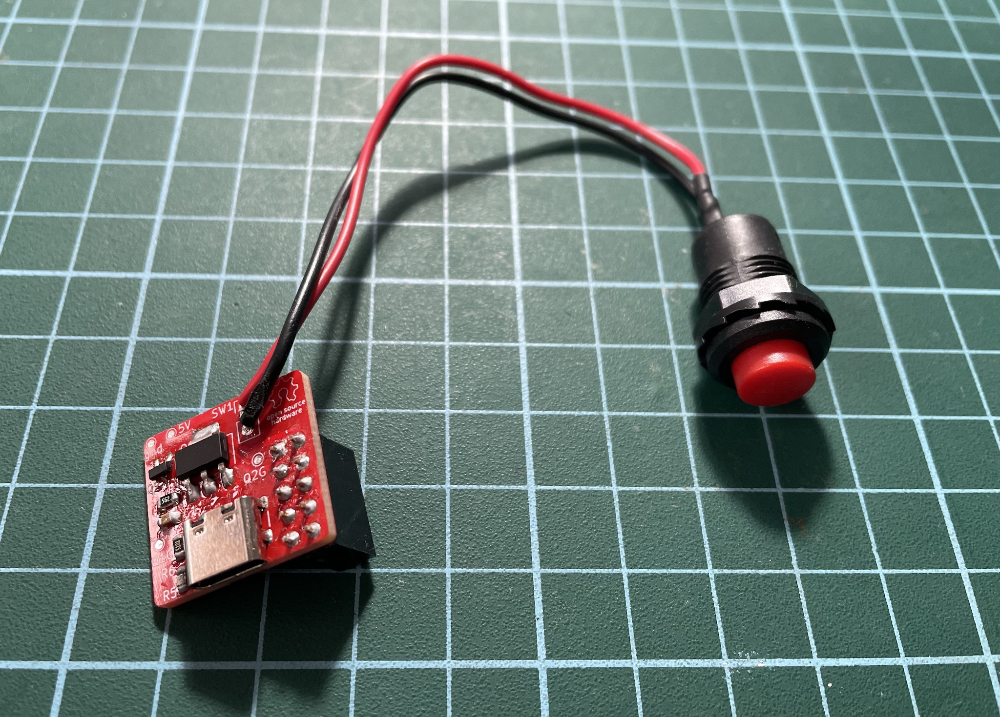
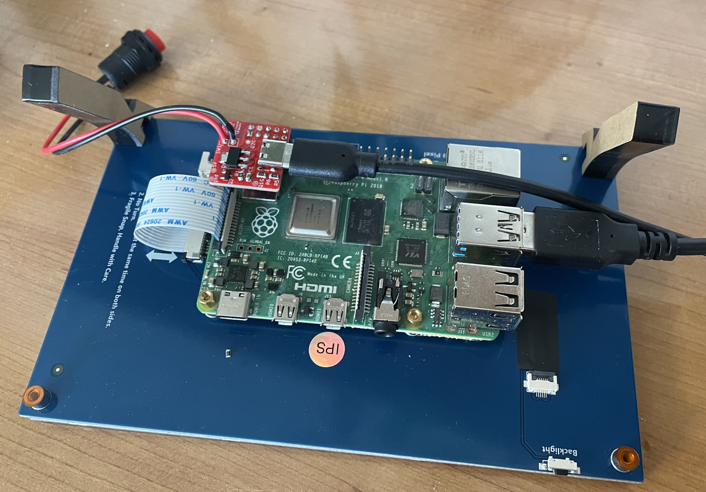
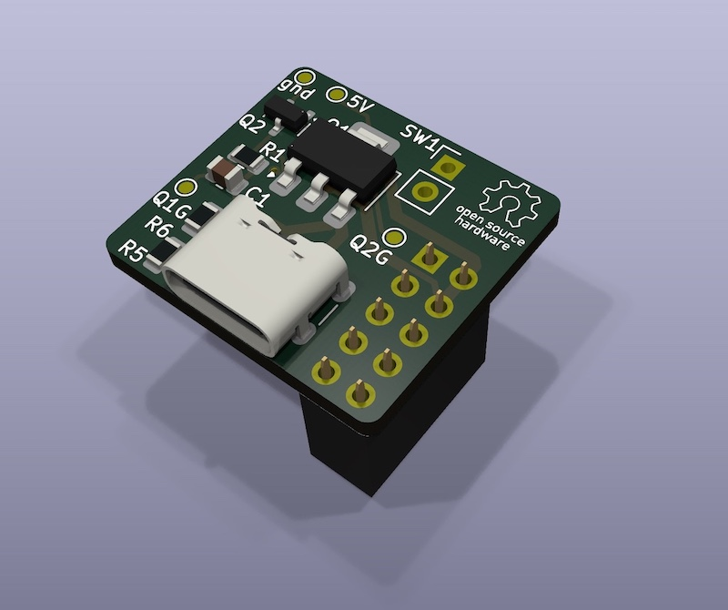
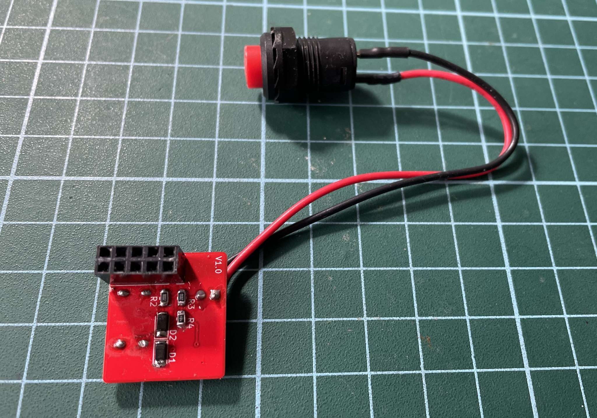
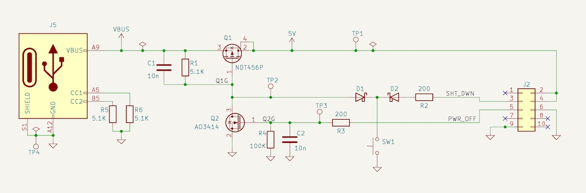

# Raspberry Pi Power Button HAT - Power On, Shutdown and Power off

### Mini HAT with a Push Button to **Power** the Raspberry Pi **On** and **Off** Safely, After the Shutdown Completes.

- When the Raspberry Pi is **off**, a button press powers it on.
- When the Raspberry Pi is **on**, a button press initiates the shutdown sequence, and when it completes, cuts the power automatically.
- An additional switch in the USB cable is not necessary; after the shutdown, the power is completely off.

Only shutdown sometimes is not enough. After the shutdown the Raspberry Pi enters a halted state, the operating system has ceased all activity, but the hardware remains powered. Most models continue to draw power (approx. 1.5W for a Pi 4). The red Power LED often remains lit, and some peripherals, like a DSI display, can remain powered with backlight active.

This little board is useful for home devices, like audio players or home theater systems, to avoid having to initiate the shutdown in the user interface, wait some time, and then cut off the power manually.

If you initiate the shutdown from the device user interface it works the same, after the shutdown sequence, it will cut the power.

## The Mini HAT:

<p float="left">


</p>


- **USB-C power connector**. Use only this connector to power the Raspberry Pi.
- **Push button**. A push button of any size or type.
- **5x2 socket** to plug into the Raspberry Pi header. It provides access to GPIO2, GPIO3, and power pins. 

<p float="left">


</p>


## GPIO pins and Overlays:
You have to configure **GPIO 2 and 3** in the config.txt file. For power management, we specifically use these two specialized **overlays**:

- **gpio-shutdown**:
  - What it does: Configures a GPIO pin to act like a keyboard's power button.
  - The Result: When the pin is triggered, it sends a KEY_POWER event to the system, which tells systemd to perform a clean, safe shutdown. It is much safer than simply pulling the power plug.
    
- **gpio-poweroff**:
  - What it does: Reaches out to the "outside world" after the Pi has finished its shutdown process.
  - The Result: Once the Pi's software is completely halted, it flips the state of a GPIO pin. This is intended to signal an external circuit (like our HAT) that it is now safe to physically cut the electricity to the Pi. 

### GPIO 2: Shutdown (gpio-shutdown) 
- Add ***dtoverlay=gpio-shutdown*** to your config file to enable GPIO 2 as the shutdown trigger.
- Configuration: Add this line to your config file:    
    ``dtoverlay=gpio-shutdown,gpio_pin=2,active_low=1,gpio_pull=up``

### GPIO 3: Power-Off Signaling (gpio-poweroff)
- Add ***dtoverlay=gpio-poweroff*** to your config file to enable GPIO 3 as the poweroff trigger.
- The pin will transition to its active state (LOW) only after the kernel has finished shutting down, ensuring no SD card corruption occurs 
- active_low=1: The pin is HIGH (3.3V) while the Pi is running and transitions to LOW (0V) once it is safe to cut power
- Configuration: Add this line to your config file:    
    ``dtoverlay=gpio-poweroff,gpiopin=3,active_low=1``

For example:

```bash
[all]
# Add your shutdown/poweroff overlays here
dtoverlay=gpio-shutdown,gpio_pin=2,active_low=1,gpio_pull=up
dtoverlay=gpio-poweroff,gpiopin=3,active_low=1
```

 
### Config file Location
Configure the behaviour of the GPIO pins in the Raspberry Pi config file:

- Raspberry Pi OS Bookworm (and newer): The file is located at /boot/firmware/config.txt.
- Older OS Versions (Bullseye and earlier): The file is located at /boot/config.txt.
- On another computer: If you insert the SD card into a PC or Mac, the file is located in the root directory of the small partition named boot or bootfs.


## The circuit 
Basic power latch circuit combined with the ***shutdown*** and ***poweroff*** GPIO's to manage the power off sequence.



- Before the button is pressed Q1 is off because R1 keeps the gate at the same voltage than the source. There is no power at the 5V pin.
- When the button is pressed, it brings the gate of Q1 to GND, activating the power. C1 prevents button bouncing.
- When the Rasperry Pi boots it keeps the GPIO 3 (power_off pin) up, keeping Q2 on, what keeps Q1 also on.
- When the Rasperry Pi is on and the button is pressed again, it sends a LOW signal to the GPIO 2 (sht_dwn pin), what initiates the shut down sequence.
- When shut down sequence completes, the GPIO 3 (power_off pin) goes LOW, what switchs Q2 off, and therefor Q1 switchs off also, and the power gets cut off.


## Restrictions
- The total current, including anything connected to the Raspeberry Pi, should not be more than 6A (about 30W), to be on the safe side. The absolute maximum rating of the main mosfet is 7.5A.
- The HAT takes the first 10 pins of the header, to use two 5V and two GND pins, and also for stability.  It means that the pins of GPIO's 2,3,4,14,15 are not available in the header for other uses.
- Conflict with I2C: Because Pin 5 (GPIO 3) is the only pin that can wake the Pi from a deep sleep, using it for a shutdown button will conflict with I2C devices.
- There are no power or USB protections in the PCB. **Use at your own risk!**


## Compatibility with Raspberry Pi Versions
The overlays used for shutdown and power-off are supported on almost all models, provided you are using a modern operating system (Raspbian Stretch 2017 or newer). 

- **Raspberry Pi 4 & 5**: Fully compatible. Note that while the physical pinout is identical, the Raspberry Pi 5 uses a new RP1 chip for I/O; however, the kernel handles these device tree overlays so they function the same way as on older boards.
- **Raspberry Pi 2, 3, Zero, and B+**: Fully compatible with the standard 40-pin header.
- **Original Raspberry Pi 1**: Probably not compatible without modifications. On these specific early models, GPIO 1 is used for shutdown instead of the modern standard GPIO 3

Anyway, I have only tested it with a Raspberry Pi 4b.

### There are no power or USB protections in the PCB. **Use at your own risk!**


